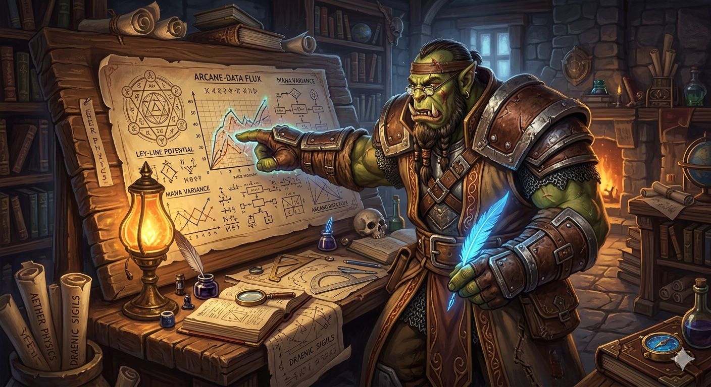

# dORCtor's Lab — WoW Mythic+ Meta Predictions

> *"The scrolls don't lie. Next week, the Resto Druid falls."*

A weekly data pipeline that tracks the **World of Warcraft Mythic+ spec meta** and predicts which specs and compositions will dominate the following week — before the weekly reset happens.

**[View the live report →](https://calebemonteiro.github.io/wow-meta-predictions/)**

---

## The Problem With the Meta

If you've played Mythic+ for more than a season, you know the feeling.

You spend weeks gearing an Unholy Death Knight, perfecting your rotation, pushing keys — and then a balance patch drops. Suddenly your spec is off every group's list. You're not bad. The meta just moved without you.

Or maybe you're a group leader. You want to push into higher keys this week, but you're not sure if it's worth swapping your healer. Is Mistweaver still the right call? Is that Augmentation Evoker spot actually earning its place, or is the data not there?

The meta is constantly shifting. Most players are reacting to it **two to three weeks late** — after streamers notice, after Wowhead posts a tier list, after the damage is already done.

---

## What This Is

Every week, this project pulls the **top-ranked Mythic+ runs from Raider.io** (up to 20,000 runs per collection), aggregates spec participation rates, key levels, and timed percentages, then runs a time-series model to forecast **what the meta will look like next reset**.

The result is a self-contained report showing:

- **Current meta** — which specs are actually represented at high keys right now, by role
- **Next week prediction** — where each spec's participation is headed, with a confidence interval and trend label
- **Participation trends** — multi-week history so you can see momentum, not just a snapshot
- **Top tank/healer combos** — which compositions are clearing keys at the highest rates
- **Dungeon breakdown** — which specs are favored in each specific dungeon this week

---

## Why This Data Matters

### For players

You can stop reacting and start planning. If the model shows your spec is rising before the community notices, you have a head start on gearing. If it's falling, you have time to decide — adapt early or stick to what you love with eyes open.

### For group leaders and guilds

Roster decisions are easier when you can see trends over multiple weeks rather than guessing from feel. A spec that looks stable might be quietly declining. One that looks weak now might be on the rise.

### For the community

The meta isn't a mystery — it's data. Making that data visible and predictable means players can make informed choices instead of chasing whatever the top 0.1% happened to play this week. That's better for build diversity, better for fun.

### For Blizzard (if they were listening)

When one spec dominates participation in 9 out of 10 dungeons for four consecutive weeks, that's not player preference — that's a tuning problem. This kind of longitudinal data makes those imbalances impossible to ignore.

---

## How It Works

The data pipeline runs manually each week after the weekly reset:

```
Raider.io API → SQLite → Aggregation → ML Model → This report
```

1. Top-ranked runs are fetched from the **Raider.io API** — every run includes the full 5-player roster with class, spec, and role
2. Spec participation is computed per week as a percentage of total runs (not raw counts)
3. A **weighted linear regression + moving average ensemble** predicts next week's participation, weighted to favour recent weeks over older history
4. The rendered report is a single self-contained HTML file with no server required

The model labels each spec's trend as **rising**, **falling**, **stable**, or **new** based on its week-over-week slope, and outputs a 90% confidence interval so you can see how certain each prediction is.

---

## Varying the Game

The most interesting use of this data isn't just reading it — it's acting on it.

**What if your guild decided to gear for the *predicted* meta instead of the current one?** You'd consistently be ahead of the curve. You'd be the group that already has a geared Preservation Evoker when everyone else is scrambling for one.

**What if spec diversity became a measurable community goal?** Tracking how many distinct specs appear in the top 10 per role each week gives a concrete health metric for the game — one that balance patches can move.

**What if you used the dungeon breakdown to pick your weekly push?** Knowing that your spec massively over-indexes in two specific dungeons this week isn't just trivia. It tells you where to invest your key attempts.

The data is public. The predictions update every week. What you do with them is yours to decide.

---

## Stack

Built with Python, scikit-learn, SQLite, Jinja2, and Chart.js. Data sourced from the [Raider.io API](https://raider.io/api). Icons from Wowhead and WarcraftLogs CDNs, stored locally.

The source code and model are in a private repository. This page is the output.

If you have ideas, want to collaborate, or just want to talk data and Mythic+ — reach out at [me@calebemonteiro.com](mailto:me@calebemonteiro.com).

---

*Updated weekly after the Mythic+ reset. Predictions are statistical estimates, not guarantees — the meta has a way of surprising everyone.*
